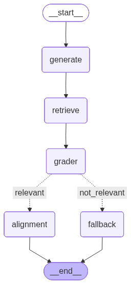

## Agentic / Corrective RAG

This project currently implements a **Corrective RAG (CRAG)** pipeline with a roadmap toward a **fully agentic RAG** system.

Today it:

- **Crawls / fetches** web content.
- **Cleans and chunks** documents using LangChain text splitters.
- **Indexes chunks** into a vector store for retrieval.
- **Runs a graph of nodes** (see `graph/`) to orchestrate retrieval, tool calls, and corrective reasoning over retrieved chunks.

In its **agentic** version, this graph will be extended so that nodes can:

- **Plan and decompose** complex user goals into sub-tasks.
- **Call tools iteratively** (e.g. web, code, vector search) based on intermediate results.
- **Adapt retrieval strategies** (re-query, re-rank, expand/collapse chunks) when evidence is missing or low-confidence.
- **Write back** new/updated knowledge into the vector store or external systems when appropriate.

### Graph overview

The high-level graph used in this repo:

At a glance:

- **Ingestion path**: tools in `tools/` pull and split data into semantic chunks.
- **Graph nodes**: `graph/nodes.py` wires together CRAG-style retrieval + verification + answer synthesis.
- **Vector store**: `vectorstore/` holds embeddings and supports similarity search (and will later back agent tools that read/write knowledge).

